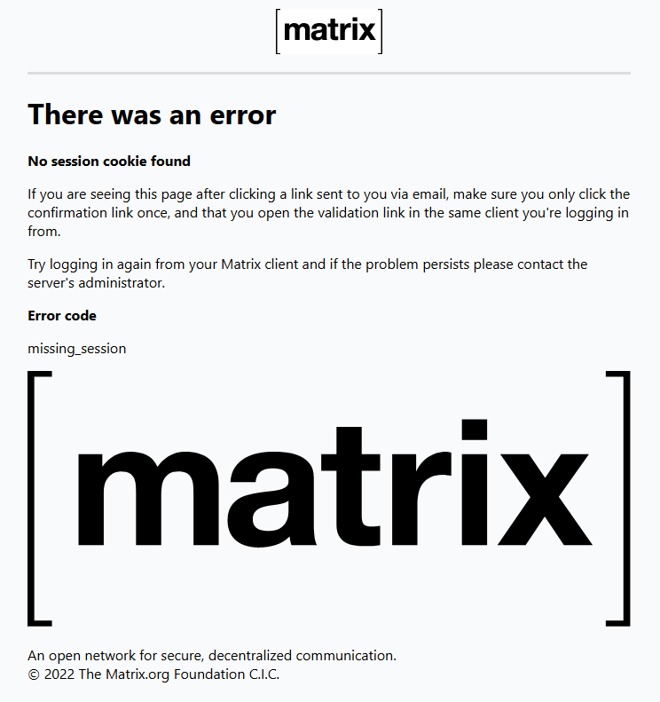

# 天空岛 Matrix 注册与使用

天空岛具有配套的 Matrix 服务。以下是详细的注册及使用教程，方便您参考。

## 账号关联

由于 Misskey 未提供 OAuth2.0 授权接口，本站使用的是 [喵窝](https://docs.nya.one)的MiSSO 系统来连接 Misskey 与 Matrix 的账号。之前的账号已经由管理员将其关联至 Misskey 身份，您可以直接使用授权登录。关于 MiSSO 具体的使用方式请参见 [使用 MiSSO](https://docs.nya.one/peripheral/misso/use/) 部分。

需要注意的是，有部分客户端可能不支持 OAuth2 模式的身份认证登录，我们推荐您使用一些较为成熟的客户端解决方案。如您真的很希望使用这些客户端，您可以尝试与开发者取得联系，与其分享详细的 OIDC 身份验证流程。

## 使用

请注意，出于对用户信息的保护政策， Matrix 具有严格的端到端加密验证要求，您新登录的设备需要在旧设备上完成验证才可解密旧消息；您需要备份安全密钥，并妥善保管，以便保证其他设备上的会话不会遗失。当您在新设备登录时，您需要使用设备交叉验证，或是使用安全密钥来恢复先前收发的消息。

若您登出了旧设备，您从该设备上发送的消息会被标记为“由已删除的会话加密”。

我们推荐您使用 element 作为连接使用的客户端，您可以在 [tim.rdpstudio.top](https://tim.rdpstudio.top) 使用已经预先配置好的网页版 element ，或是在 [element.io/get-started](https://element.io/get-started) 下载客户端。当然，您也可以使用任何支持 Matrix 协议的客户端，您可以在 [matrix.org/clients](https://matrix.org/clients/) 查看到官方认可的应用列表。
如果您使用的是本地客户端登录的方案，你需要手动配置服务器地址为 `t.rdpstudio.top`。

您会默认加入到我们实例的公开空间 `#home:t.rdpstudio.top` ，欢迎各位加入，也欢迎您加入其他任何的其他实例群组。玩得愉快！

## 错误处理

如果您在执行相关操作时遇到 Matrix 授权不通过，出现如下图所示的 `No session cookie found` 错误时，您可尝试先登出网页版客户端，再重新登录以记录您的会话 session 数据。该错误通常发生于在 MiSSO 系统启动前即有了登录状态的用户账户上。

